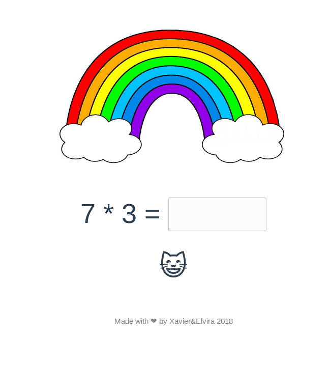

# ggr

**ggr** from Swedish *gånger* means among other things *multiplications*. The idea to write this web site came to me when my daughter prompted me to throw single digit multiplications at her for practice. I was learning some Vue.js at the time and setting up a web creation pipeline in Google Cloud and so https://ggr.trackit.fun was born.

**ggr** is a Vue.js application in its simplest form. I have in mind some features that I would like to add in time, at the moment it is only capable to generate a multiplication and smile or be sad at you depending on the correctness of your answer. You can also click the multiply symbol and it will generate easier addition operations for you.

Contributions are welcome.